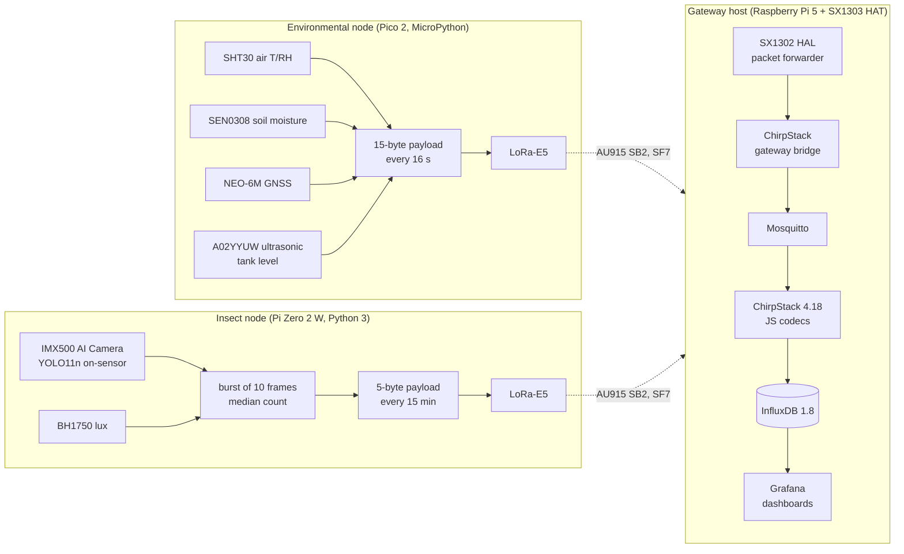

# WSN-agriculture-Insect

A two-node LoRaWAN smart-agriculture sensor network built from low-cost, off-the-shelf parts, with
insect counting done **on the image sensor itself**. One node samples the environment (air
temperature and humidity, soil moisture, tank water level, GNSS position); the other points a
Sony IMX500 AI Camera at a yellow sticky trap, runs a quantised YOLO11n detector inside the sensor
and transmits only a count. Both nodes uplink over AU915 LoRaWAN to a self-hosted gateway and
server stack (ChirpStack, InfluxDB, Grafana) on a Raspberry Pi 5. No image ever leaves the trap.

This repository is the companion to Benjamin Earnshaw's ENP4111 Research Project dissertation
(University of Southern Queensland, 2026). Appendix A of the dissertation reproduces the payload
codecs and the redacted server configuration and maps every artefact to the files here.

## How it works



* **Environmental node** – Raspberry Pi Pico 2 (RP2350, non-wireless) in MicroPython. Both hardware
  UARTs were taken by the GNSS receiver and the radio, so the ultrasonic ranger's serial stream is
  decoded by a receive-only UART synthesised in a PIO state machine (GP16). Values are packed into a
  fixed-length 15-byte big-endian payload and sent as unconfirmed uplinks.
* **Insect node** – Raspberry Pi Zero 2 W with the Raspberry Pi AI Camera. The sensor returns only
  inference metadata (300 post-NMS slots of boxes and scores); the host counts the slots above a
  confidence threshold in each frame of a short burst, reports the median, and adds the peak
  confidence and the ambient illuminance. During the counting campaigns the same program also saved,
  after each uplink, a clean frame for blind manual counting, a marked frame, the detections as JSON
  and a row in `counts.csv`.
* **Server stack** – everything runs on the gateway host with no cloud dependency. The JavaScript
  codecs decode each payload into named fields; ChirpStack's InfluxDB integration stores every field
  as its own measurement together with the RSSI, SNR and frame counter of each uplink, and Grafana
  dashboards show the telemetry and the link statistics, including an hourly delivery ratio computed
  from the frame counter.

## Hardware

| Subsystem | Component | Interface | Role |
|---|---|---|---|
| Environmental node | Raspberry Pi Pico 2 (RP2350) | – | MicroPython host |
| | Sensirion SHT30 in a weatherproof probe (Adafruit 4099) | I²C | air temperature and humidity |
| | DFRobot SEN0308 capacitive soil probe v2 | ADC | volumetric soil moisture |
| | u-blox NEO-6M | UART | GNSS position |
| | DFRobot A02YYUW waterproof ultrasonic ranger | UART (PIO) | distance to water surface → tank level |
| | Makerverse LoRa-E5 breakout (Seeed LoRa-E5, STM32WLE5) | UART (AT) | LoRaWAN modem |
| Insect node | Raspberry Pi Zero 2 W | – | Linux host |
| | Raspberry Pi AI Camera (Sony IMX500) | CSI-2 | on-sensor inference, ≤ 8 MB model budget, 640 × 640 input |
| | DFRobot SEN0562 (BH1750) IP68 light sensor | I²C | ambient illuminance, 1–65,535 lx |
| | Makerverse LoRa-E5 breakout | UART (AT) | LoRaWAN modem |
| Gateway / server | Raspberry Pi 5 + Waveshare SX1303 LoRaWAN HAT | SPI | eight-channel concentrator and server host |
| Instrumentation | Fluke 289 logging multimeter | series DC | MIN MAX AVG current recording |

Single-unit parts cost: about AUD 1,515.

## Radio and payloads

AU915 sub-band 2 (uplink channels 8–15, 916.8–918.2 MHz, plus 917.5 MHz at 500 kHz), OTAA, Class A,
fixed DR5 (SF7, 125 kHz), ADR off, unconfirmed uplinks. LoRaWAN 1.0.2 / Regional Parameters revision A
on the server's device profiles.

Environmental node, 15 bytes, big-endian:

| Bytes | Field | Type | Encoding |
|---|---|---|---|
| 0–1 | temperature | int16 | °C × 100, two's complement |
| 2–3 | humidity | uint16 | % RH × 100 |
| 4 | soil_moisture | uint8 | volumetric % |
| 5–8 | latitude | int32 | degrees × 10⁶ |
| 9–12 | longitude | int32 | degrees × 10⁶ |
| 13–14 | distance | uint16 | mm to the water surface (tank level = mounting height − distance) |

Insect node, 5 bytes:

| Bytes | Field | Type | Encoding |
|---|---|---|---|
| 0–1 | insect_count | uint16 | burst-median count of detections above the threshold |
| 2 | max_conf | uint8 | peak detection confidence × 100 |
| 3–4 | lux | uint16 | illuminance, lx |

The decoders in `chirpstack codec/` use plain arithmetic rather than bitwise operators, which the
codec runtime did not reliably support. The field names they emit become the InfluxDB measurement
names (`device_frmpayload_data_<field>`), so adding a sensor field needs no change downstream.

## Results at a glance

| Measure | Result |
|---|---|
| Detector (validation split, 138 phone-camera images) | precision 0.822, recall 0.816, mAP@0.5 0.835, mAP@0.5:0.95 0.328 |
| On-sensor execution | 60.0 ms per inference, 133.2 ms delivery period at 30 fps (7.5 inferences/s sustained); 7.12 MB of the 8 MB on-chip budget |
| LoRaWAN delivery, 48 h campaign (8–10 Sep 2026) | environmental node 10,642 of 10,668 uplinks (99.76 %, no hour below 98.2 %); insect node 192 of 192 |
| Link quality at the gateway | RSSI about −27 dBm, SNR about +13 dB on both nodes; weakest frames still ≥ 7.5 dB above the SF7 demodulation floor |
| Counting agreement, 25 Aug (n = 47 pairs, 1–32 insects) | bias +3.26 insects, 95 % limits −1.98 to +8.49 at the deployed 0.40 threshold; +1.09 (−2.32 to +4.49) at 0.50 |
| Counting agreement, 8–10 Sep (n = 97 pairs, 1–102 insects) | bias +5.16 (−9.02 to +19.35) at 0.40; −0.01 (−13.85 to +13.83) at 0.50; width driven by transient shadowing of the trap |
| Power, continuous → software-optimised | environmental node 83.0 → 31.6 mA average (3.0 → 7.9 days on 6,000 mAh at 5 V); insect node 229.1 → 129.7 mA (1.1 → 1.9 days) |

## Repository layout

| Path | Contents |
|---|---|
| `insect node python files/insect_node_boxtest.py` | Insect node program as run in the counting campaigns: LoRa-E5 AT driver, warm IMX500 pipeline, burst-median counting, BH1750 reading, five-byte payload, and the per-sample logging routine (clean frame, marked frame, detections JSON, `counts.csv` row). |
| `insect node python files/insect_node.py` | The same node without the logging routine. |
| `insect node python files/bland_altman_capture.py` | Stand-alone capture tool for the counting-agreement study (no radio). |
| `insect node python files/*_test.py`, `box_*.py`, `detect_debug.py`, `score_check.py`, `show_labels.py` | Bench tests used during commissioning. |
| `Torch_model.pt` | Trained YOLO11n weights (`exp-2(2).pt` is an identical copy). |
| `Quantised_IMXmodel.zip` | IMX500 export of the detector: `model_imx.onnx`, `dnnParams.xml`, `packerOut.zip`, memory report. |
| `insects(6).ndjson` | Export of the training dataset (687 images, 5,172 boxes, 549 train / 138 val) from the Ultralytics Platform. |
| `chirpstack codec/` | ChirpStack JavaScript decoders for the two payloads. |
| `chirpstack_export/config/` | `chirpstack.toml` and region files, `chirpstack-gateway-bridge.toml`, `mosquitto.conf`, `influxdb.conf`, `grafana.ini`, as deployed. |
| `chirpstack_export/chirpstack_db.sql` | Dump of the ChirpStack database (device profiles, devices, gateway, integration). |
| `global_conf.json` | SX1302 HAL packet-forwarder configuration of the SX1303 HAT (AU915 sub-band 2). |
| `Grafana Dashboards/` | Grafana exports of the environmental-node, insect-node and network-reliability dashboards. |
| `aug25_link.csv`, `sept_link.csv` | `device_uplink` exports (time in ns, DevEUI, RSSI, SNR, frame counter) for 25 August 2026 06:00–19:20 and for 8 September 06:08 to 10 September 06:20, Perth time. |

Root-level copies of some node files and dashboards duplicate the ones in the folders. The
environmental node's MicroPython firmware is not yet in the repository.

Related deposits: the training dataset and the YOLO11n training run are on the Ultralytics Platform
([dataset](https://platform.ultralytics.com/benjamin-earnshaw/datasets/insects),
[training project](https://platform.ultralytics.com/benjamin-earnshaw/insects)); the campaign frames,
detection files and count logs are on Kaggle
([campaign 1](https://www.kaggle.com/datasets/c1bc959f42ef7252280856b6fb89e3d88fc4aa4be668d2efb572664d584c8f2f),
[campaigns, v2](https://www.kaggle.com/datasets/772a01de4dde5029d298ff9e658e5f873e9bb3f32abafcf57a1581b7698fc638)).

## Reproducing the system

**Gateway and server (Raspberry Pi 5)**

1. Install ChirpStack 4.18, the ChirpStack gateway bridge, Mosquitto, InfluxDB 1.8 and Grafana;
   copy `chirpstack_export/config/` into `/etc/` and set the two `REDACTED` values in
   `chirpstack.toml` (PostgreSQL password, API secret). Only the MQTT integration is enabled in the
   file; the InfluxDB integration is added per application in the web interface
   (`http://localhost:8086/write`, database `chirpstack`, precision 1 s).
2. Build the SX1302 HAL packet forwarder (the Raspberry Pi 5 needs the build whose GPIO reset
   script is adapted to its new I/O controller) and run it with `global_conf.json`; the gateway EUI
   `00016c001f16188e` is the one registered on the server.
3. Register the server objects as in Appendix A, Table A.4 of the dissertation, or restore
   `chirpstack_db.sql` and re-enter the device keys: two device profiles (AU915, LoRaWAN 1.0.2 rev A,
   OTAA, Class A, JavaScript codec from `chirpstack codec/`), one application with the InfluxDB
   integration, the gateway bound to `au915_1`.
4. In Grafana add an InfluxDB (InfluxQL) data source for database `chirpstack` and import the
   three JSON files from `Grafana Dashboards/`.

**Insect node (Raspberry Pi Zero 2 W)**

1. Raspberry Pi OS 64-bit; `sudo apt install imx500-all python3-picamera2 python3-pil`;
   `pip install pyserial smbus2`. Enable I²C and the camera; enable the PL011 UART and disable the
   serial console (`raspi-config` → Interface Options → Serial Port).
2. Wire the LoRa-E5 breakout: VIN → 5 V (pin 2), GND → pin 6, breakout TX → Pi RXD (pin 10),
   breakout RX → Pi TXD (pin 8); antenna fitted. BH1750 on I²C bus 1 at 0x23.
3. Unpack `Quantised_IMXmodel.zip`, package `packerOut.zip` into the sensor firmware (`network.rpk`)
   with the IMX500 packager and place it at `MODEL_PATH` in the program.
4. Paste the device's AppKey from ChirpStack into `APP_KEY` and run
   `python3 insect_node_boxtest.py` under `tmux` (56 samples at 15 min = 14 h per run; the CSV is
   flushed after every sample and a restart resumes it).

**Environmental node (Raspberry Pi Pico 2)** – peripheral map: UART1 LoRa-E5, UART0 NEO-6M,
I2C1 SHT30, ADC0 soil probe, PIO UART on GP16 for the A02YYUW (9600 baud). The radio is configured
with the same AT sequence as the insect node (`AT+MODE=LWOTAA`, `AT+DR=AU915`, `AT+ADR=OFF`,
`AT+DR=5`, `AT+CH=NUM,8-15`, identity, `AT+KEY=APPKEY`, `AT+JOIN`) and uplinks with `AT+MSGHEX`.

**Exporting the network record** (on the gateway host):

```bash
influx -database chirpstack -format csv -precision ns -execute \
  "SELECT dev_eui, rssi, snr, f_cnt FROM device_uplink \
   WHERE time >= '2026-09-07T22:07:56Z' AND time <= '2026-09-09T22:19:46Z'" > sept_link.csv
```

Delivery ratio from the record: frames sent = span of the frame counter + 1, frames received = rows;
each gap in the counter is a lost uplink. The dashboard computes the same per hour with
`count("f_cnt") * 100.0 / (spread("f_cnt") + 1)`.

## Data files

`aug25_link.csv` / `sept_link.csv`: `name, time, dev_eui, rssi, snr, f_cnt` — one row per uplink
received, `time` in nanoseconds since the epoch (UTC; Perth is UTC+8), DevEUI `70b3d57ed00778cc`
environmental node, `70b3d57ed0077801` insect node.

`counts.csv` (in the Kaggle datasets): `frame_id, timestamp, node_count, max_conf, lux, count_0.30,
count_0.40, count_0.50, manual_count` — `frame_id` is the `YYYYMMDD_HHMMSS` tag shared by
`<tag>_clean.jpg`, `<tag>_marked.jpg` and `<tag>_boxes.json`; `node_count` is the transmitted
burst median; the three `count_*` columns are the detections of the saved frame at each threshold;
`manual_count` is the observer's blind count of the clean frame (blank below the 10 lx pairing floor).

## Credentials and location data

No secret is kept in this repository. The LoRaWAN application keys in the node programs are
placeholders (`00 00 … 00`) to be replaced with the key generated in ChirpStack for each device; the
database dump has its device keys, session state, user password hash and integration password
removed; the PostgreSQL password and API secret in `chirpstack.toml` are `REDACTED`; and the packet
forwarder's reference coordinates are zeroed. Keys that appeared in earlier commits of this
repository must be regarded as compromised and are being replaced.

## Citation

B. Earnshaw, "WSN-agriculture-Insect: node programs, payload codecs, server and gateway
configuration, dashboard definitions and network records of a two-node LoRaWAN smart-agriculture
sensor network," GitHub repository, 2026. https://github.com/earny26081987/WSN-agriculture-Insect

## Licence

Code is released under the MIT License (see `LICENSE`). Data files, dashboard definitions,
configuration and the trained models are released under the Creative Commons Attribution 4.0
International licence (CC BY 4.0).
